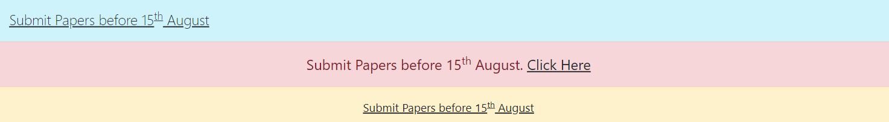
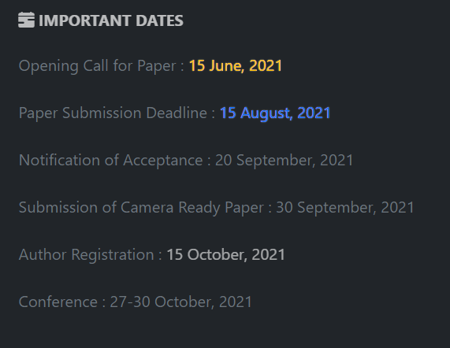
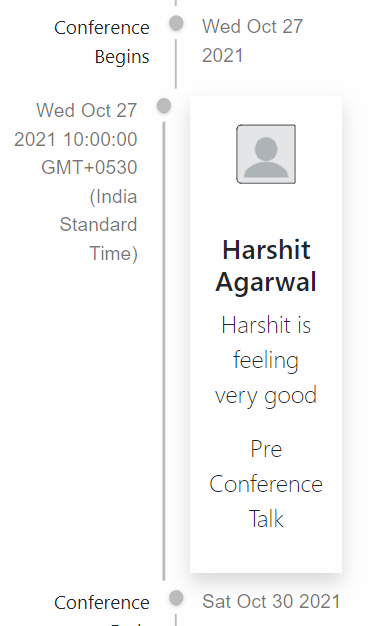
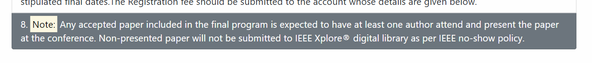
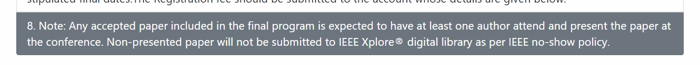
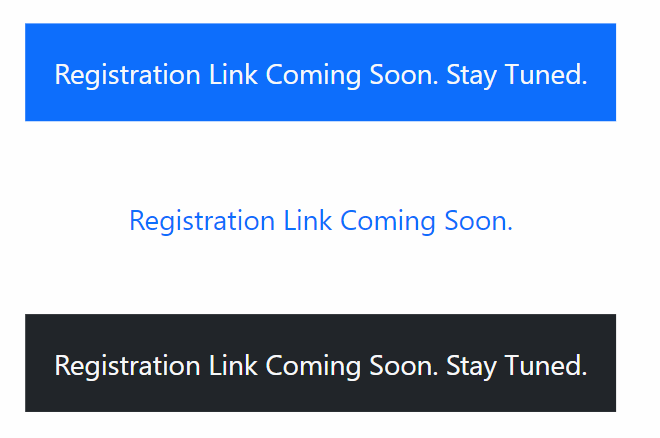

https://soutrikdas.github.io/routerdomrough/build/#/committee/organizing

## Inactive / Disabled Links 
Use 
`bg-secondary pe-none` to disable links 
where `pe-none` is `pointer event none` so no clickable mouse icon

Alert ( Since Submission link is hidden inside Call for regular paper)

Yellow or Blue or High Opacity footer

Timeline 

No SHow policy 

Or 

Do they have to take snapshot

Registration notice 

or rounded ? 